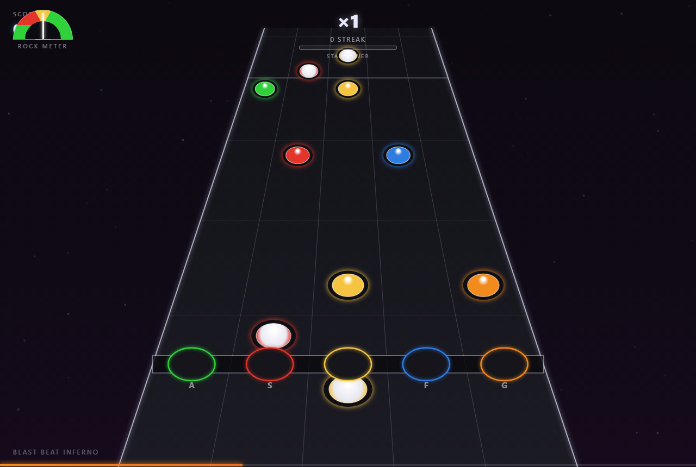
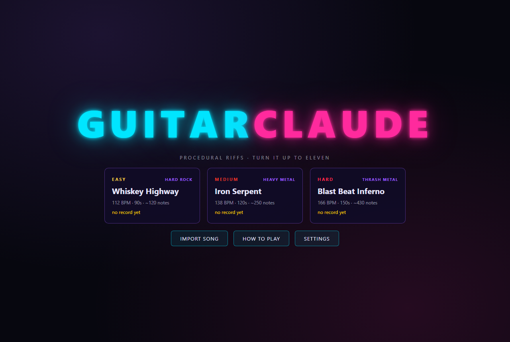

# Guitar Claude

A Guitar Hero 2-style rhythm game built as a desktop app with **Electron + React 18 + TypeScript (strict)**, rendered on HTML5 Canvas at 60 fps, with fully procedural songs and synthesized audio (no asset files at all).

Gameplay follows GH2's systems: fret + strum input, overstrums, hammer-ons/pull-offs, sustain notes, star power, and a rock meter that fails the song when the crowd turns. (The actual GH2 — its licensed songs, art and branding — is copyrighted and can't be reproduced; this recreates the mechanics, not the assets.)

**Play it in your browser: https://joeyhanma69.github.io/guitar-claude/**

## Screenshots





## Quick Start

```bash
npm install
npm run dev        # launches Vite + Electron with hot reload
```

That's it — the Electron window opens automatically once Vite is up.

## Scripts

| Script | What it does |
| --- | --- |
| `npm run dev` | Dev mode: Vite dev server + Electron, HMR for the renderer |
| `npm run typecheck` | `tsc --noEmit` (strict mode) |
| `npm run lint` | ESLint over `src/` |
| `npm run build` | Typecheck + production build (`dist/` + `dist-electron/`) |
| `npm run dist` | Build + package installers for the current platform |
| `npm run dist:win` | Windows NSIS installer (`release/`) |
| `npm run dist:mac` | macOS DMG |
| `npm run dist:linux` | Linux AppImage + .deb |

## How to Play

Gems scroll down a 3D-perspective fretboard. **Hold the fret key and strum** as the gem crosses the fret bar — like a real guitar controller.

| Key | Action |
| --- | --- |
| `A S D F G` | Frets, green → orange (remappable in Settings) |
| `ENTER` / `R-SHIFT` / `↑` `↓` | Strum |
| `SPACE` | Activate Star Power (needs ≥ half a gauge) |
| `ESC` | Pause / resume; `Q` quits from pause |
| `R` | Restart song |
| `M` | Mute |
| `F3` | FPS counter (debug) |

### Rules (GH2-style)

- One hit window (±100 ms): a strum with the right frets connects, otherwise it whiffs.
- **Scoring:** 50 pts per gem × streak multiplier — ×2 at 10, ×3 at 20, ×4 at 30 streak.
- **Chords** need the exact fret shape; single notes allow anchoring lower frets.
- **Overstrum** (strumming with no gem in the window, or wrong frets) breaks your streak and dings the rock meter.
- **Sustains:** hold the fret after the hit — pays 25 pts per beat while held. Releasing early just stops the payout.
- **HOPOs** (white-faced gems): while the streak is alive, tap the fret — no strum needed.
- **Star Power:** hit every gem in a star phrase for +25% gauge. `SPACE` at ≥50% doubles the multiplier (up to ×8) while it drains (a full bar lasts 32 beats).
- **Rock Meter:** hits push it up, misses/overstrums pull it down. Bottom out → song failed, crowd boos you off.
- **Full Combo** = zero misses AND zero overstrums. Star rating (0–5) from accuracy + FC.
- **Strum Mode** can be turned off in Settings for casual play: fret keys hit notes directly, no strumming, no overstrums. HOPO/star-power/rock-meter rules still apply.

### Songs (all procedurally generated, deterministic seeds)

| Song | Style | Difficulty | BPM | Length | Notes |
| --- | --- | --- | --- | --- | --- |
| Whiskey Highway | Hard Rock | Easy | 112 | 90 s | ~120, quarter-beat riffs, occasional power chords |
| Iron Serpent | Heavy Metal | Medium | 138 | 120 s | ~250, eighth-note riffs, power chords, gallops |
| Blast Beat Inferno | Thrash Metal | Hard | 166 | 150 s | 400+, gallops, triplet sweeps, double-kick backing |

### Import your own songs

Menu → **Import Song** → pick any MP3/WAV/OGG/M4A. The analyzer finds the beat (onset detection over low/mid/high frequency bands), estimates the tempo, and builds a chart: bass hits land on the left frets, leads and cymbals on the right, the heaviest hits become power chords, ringing notes become sustains, and the HOPO/star-phrase passes run just like on the built-in songs. Your actual audio plays during gameplay. Charts are deterministic per file, so high scores for imported songs persist.

Charts are built the way guitar music works: each intro / verse / chorus / bridge / outro section gets its own **riff** — a short bar-length pattern anchored on a root note — which repeats with small variations, ends in a descending fill run, and rides the difficulty ramp peaking ~60% through the song. Power chords land as root+fifth lane shapes and metal songs add gallop sixteenths. Lanes map onto the E-minor pentatonic scale (lane 0 = low string) — the same scale the audio engine plays, so hitting the chart plays the riff.

## Settings (persisted)

Master / SFX / Music volume, note speed (1x–2x), screen shake, fullscreen, and full key remapping (with conflict resolution — assigning an already-used key swaps the two lanes). Stored per-user via IPC in Electron's `userData` directory (`settings.json`, `highscores.json`); high scores per song persist across sessions.

## Architecture

```
src/
├── main/main.ts              Electron main process: window, IPC, JSON store
├── preload/preload.ts        contextBridge API (no Node in the renderer)
└── renderer/
    ├── App.tsx               Phase router + React error boundary
    ├── components/
    │   ├── GameCanvas.tsx    Canvas playfield: highway, notes, FX, input
    │   ├── HUD.tsx           DOM overlay: score / combo / accuracy
    │   ├── StartScreen.tsx   Menu, song select, settings, tutorial
    │   └── GameOverScreen.tsx
    ├── engine/
    │   ├── NoteGenerator.ts  Seeded procedural charts (mulberry32 PRNG)
    │   ├── TimingEngine.ts   Hit windows, scoring, multiplier, stars
    │   └── ParticleSystem.ts Fixed-size object pool (600), zero GC in loop
    ├── hooks/
    │   ├── useGameLoop.ts    rAF wrapper, clamped dt
    │   ├── useAudio.ts       Web Audio synth engine + volume sync hook
    │   └── useKeyboard.ts    Global key handling, live remap support
    ├── store/gameStore.ts    Zustand: score/combo/settings/high scores
    ├── types/index.ts        Shared interfaces
    └── styles/App.css        Neon UI styling
```

### Performance design

- All per-frame state lives in refs — the 60 fps loop never triggers React renders. The DOM HUD only re-renders when a judgement lands.
- Particles come from a fixed 600-slot ring pool: zero allocation during gameplay, no GC pauses.
- Note scanning uses a moving window over the time-sorted chart (`scanFrom` index + early `break`), so per-frame cost stays flat regardless of chart size.
- Canvas resizes with the window via `ResizeObserver` + devicePixelRatio (capped at 2).

### Persistence & error handling

- Saves are written to a temp file then renamed — a crash can't corrupt them. A corrupted file is renamed to `*.corrupt-<ts>.bak` and defaults are restored.
- Web Audio failure degrades to silent gameplay instead of crashing.
- A React error boundary catches render crashes and offers a reload.
- The renderer also runs in a plain browser tab (falls back to `localStorage`), handy for UI work.

## For Developers

### Getting started

Node 18+ required.

```bash
npm install
npm run dev                       # Electron app with hot reload
```

Browser-only dev (no Electron window):

```powershell
$env:WEB_ONLY = '1'; npx vite     # PowerShell
WEB_ONLY=1 npx vite               # bash
```

### Debug tools

- `F3` in game — FPS counter
- `/?song=<id>` — deep-link straight into a built-in song (`whiskey-highway`, `iron-serpent`, `blast-beat-inferno`)
- `&seek=<ms>` — start mid-song; earlier notes are skipped without penalty (handy for testing late sections)
- Dev builds expose console hooks: `window.__nfStore` (the zustand store — read state or drive the game: `__nfStore.getState().startGame(...)`) and `window.__nfAnalyze` / `window.__nfImportFile` (the import pipeline)

### Where to tune things

| What | Where |
| --- | --- |
| Hit window, scoring, multipliers, rock meter, star power | [src/renderer/engine/TimingEngine.ts](src/renderer/engine/TimingEngine.ts) |
| Scroll speed, lane colors, key defaults | [src/renderer/constants.ts](src/renderer/constants.ts) |
| Add a built-in song | append a `SongDef` to `SONGS` in [src/renderer/engine/NoteGenerator.ts](src/renderer/engine/NoteGenerator.ts) — pick a seed, BPM, duration and density knobs; the chart generates itself |
| Synth sounds (hits, drums, drone) | [src/renderer/hooks/useAudio.ts](src/renderer/hooks/useAudio.ts) |
| Import analysis (onsets, tempo, lane mapping) | [src/renderer/engine/AudioImport.ts](src/renderer/engine/AudioImport.ts) |
| Highway rendering & input | [src/renderer/components/GameCanvas.tsx](src/renderer/components/GameCanvas.tsx) |

### CI/CD

Every push to `main` runs [.github/workflows/deploy.yml](.github/workflows/deploy.yml): web bundle build (`WEB_ONLY=1`) → GitHub Pages deploy. Desktop installers build locally with `npm run dist:win|mac|linux`.

## Design decisions (deviations from the original spec)

- **Raw Web Audio API instead of Tone.js** — every sound here is a handful of oscillator + gain + waveshaper + filter nodes; a synthesis framework would add ~1 MB of dependency for no capability gain, and direct node scheduling gives the lowest hit-sound latency. Hit sounds are distorted power chords (sawtooth root + fifth + octave through a tanh soft-clip "amp"): perfect = bright open chord, great = detuned bend, good = dark palm-muted chug, miss = low string flub. Backing is a low-E drone plus kick/snare rock beat (double kick at 160+ BPM), tempo-locked, at low volume; combo up/down cues and a full-combo jingle round it out.
- **Minimal fs-based JSON store instead of `electron-store`** — the spec also required save-corruption recovery; a 30-line atomic-write store in the main process covers both with one less dependency.
- **Synchronous note generation instead of a Web Worker** — generating the largest chart takes well under 5 ms; a worker would add complexity for nothing. The generator is a pure module, so moving it into a worker later is trivial.
- **ESLint with `@typescript-eslint` + react-hooks recommended rules instead of the Airbnb preset** — the Airbnb config chain has a long, brittle peer-dependency tail; the enforced rules cover the same correctness ground.
- `.eslintrc.cjs` rather than `.eslintrc.js` because the package is ESM (`"type": "module"`).

### Bonus features status

Implemented: FPS counter (F3), browser-tab fallback mode, deterministic charts (replayable by seed).
Not implemented (clean extension points exist): practice-speed mode, section selector, replay recording, visualizer mode, split-screen multiplayer, song import.
